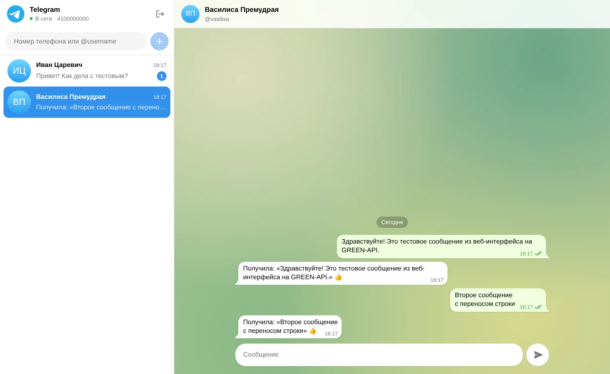
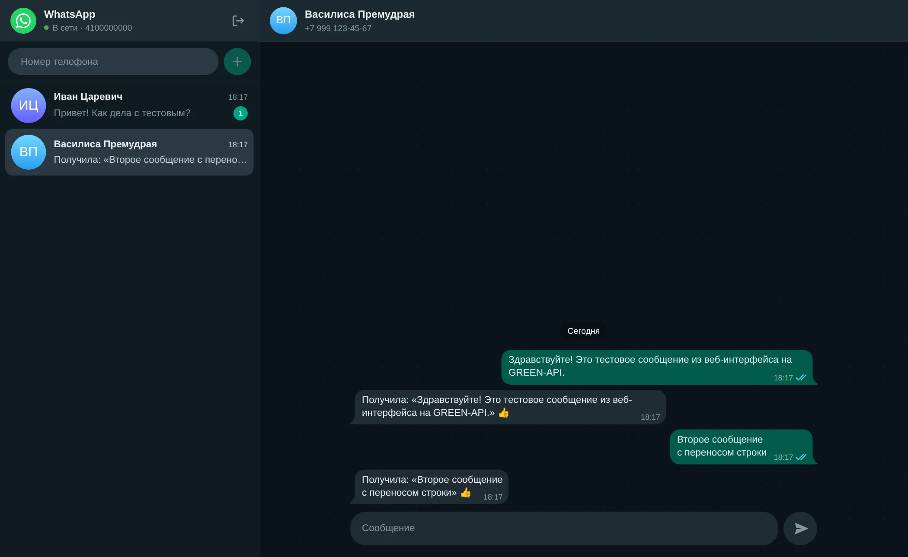
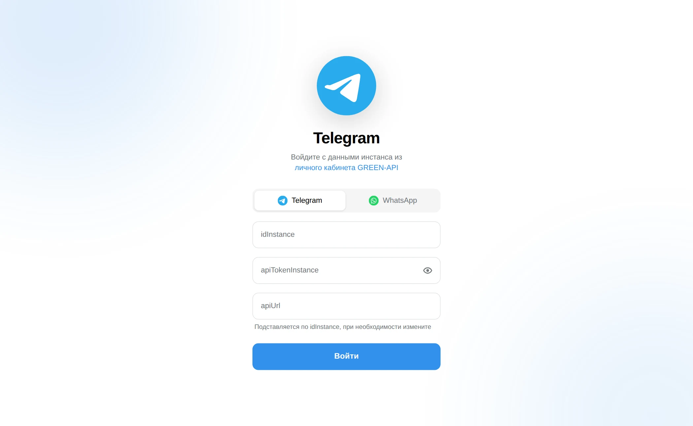
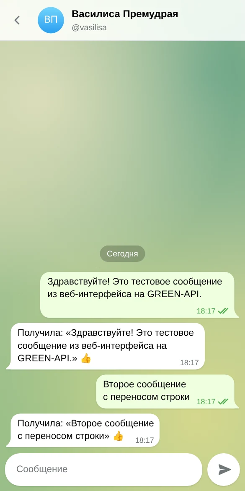
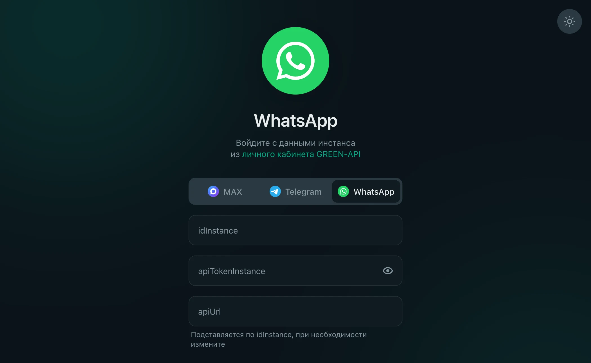
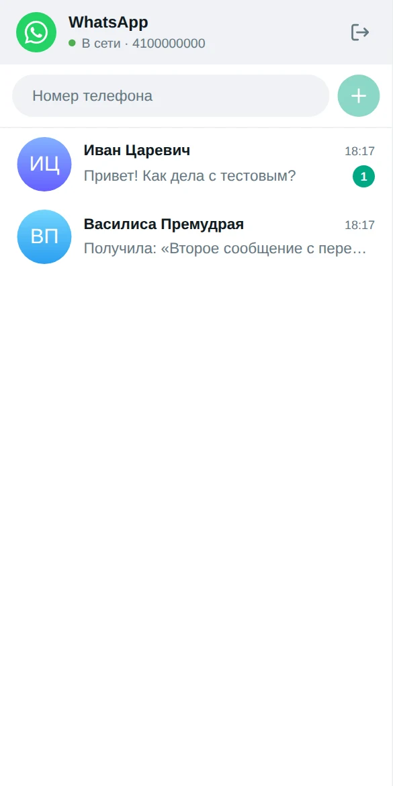
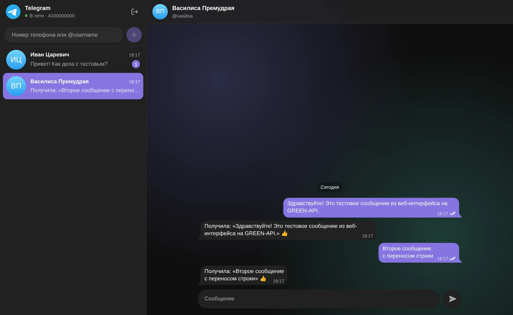
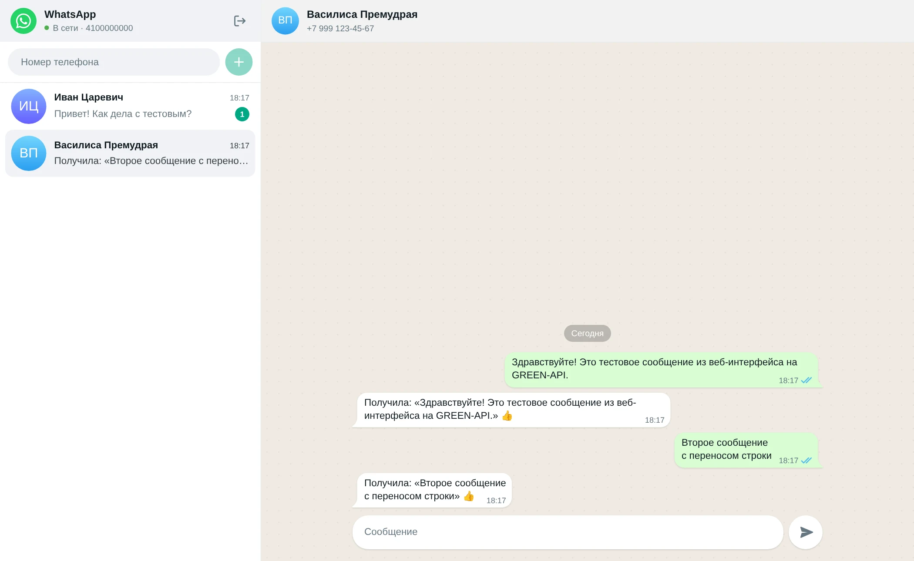

# GREEN-API Chat

Веб-интерфейс для отправки и получения текстовых сообщений в **Telegram** через
[GREEN-API](https://green-api.com/telegram/docs/). Переключателем на экране входа можно выбрать
**WhatsApp**: логика поиска собеседника и оформление подстраиваются под выбранный мессенджер.

Тестовое задание на позицию «Фронтенд-разработчик React».

<p>
  
  
</p>

## Сценарий

1. Пользователь открывает сайт, выбирает мессенджер и вводит `idInstance` и `apiTokenInstance`
   из [личного кабинета GREEN-API](https://console.green-api.com). `apiUrl` подставляется по
   первым четырём цифрам `idInstance`, при необходимости его можно изменить.
2. Вводит номер телефона получателя (в Telegram можно указать и `@username`) и создаёт чат.
3. Пишет сообщение и отправляет его получателю.
4. Получатель отвечает в мессенджере, и ответ появляется в чате автоматически.

## Возможности

- Отправка через [`SendMessage`](https://green-api.com/telegram/docs/api/sending/SendMessage/).
- Получение через HTTP API: long polling
  [`ReceiveNotification`](https://green-api.com/telegram/docs/api/receiving/technology-http-api/ReceiveNotification/)
  (`receiveTimeout=20`) с подтверждением через `DeleteNotification`.
- Статусы исходящих сообщений: отправляется, отправлено, доставлено, прочитано, ошибка. При ошибке
  есть кнопка «Повторить».
- Сообщения, отправленные с телефона, тоже появляются в чате (`outgoingMessageReceived`).
- Входящее сообщение от нового собеседника создаёт чат автоматически и увеличивает счётчик
  непрочитанных. Общее число непрочитанных выводится в заголовке вкладки.
- Индикатор соединения и автоматическое переподключение с экспоненциальной задержкой. Если
  ключи отозваны, приложение возвращает на экран входа.
- История чатов хранится в `localStorage` отдельно для каждого инстанса. Сессия хранится в
  `sessionStorage`; токен не попадает в `localStorage`.
- Светлая и тёмная темы (по `prefers-color-scheme`) в стиле Telegram Web и WhatsApp Web.
- Адаптивная вёрстка: на телефоне показывается либо список чатов, либо переписка.
- Доступность: семантическая разметка, `role="log"` для ленты сообщений, подписи у кнопок с
  иконками, видимый фокус, поддержка `prefers-reduced-motion`.

## Запуск

Нужен Node.js 20.19+ (или 22.12+).

```bash
npm install
npm run dev
```

Приложение откроется на http://localhost:5173. Бэкенд не нужен: GREEN-API разрешает CORS, и
браузер обращается к API напрямую.

### Как получить инстанс

1. Зарегистрируйтесь в [личном кабинете GREEN-API](https://console.green-api.com) и создайте
   инстанс Telegram (или WhatsApp) на бесплатном тарифе «Разработчик».
2. Авторизуйте инстанс: войдите в аккаунт Telegram по коду или отсканируйте QR-код в WhatsApp.
3. Скопируйте `idInstance`, `apiTokenInstance` и `apiUrl`.
4. Для получения сообщений через HTTP API поле `webhookUrl` в настройках инстанса должно быть
   пустым, а уведомления о входящих и исходящих сообщениях — включены (по умолчанию так и есть).

> На тарифе «Разработчик» можно переписываться не более чем с тремя чатами в месяц. При
> превышении лимита приложение показывает понятное сообщение.

## Скрипты

| Команда                | Назначение                                   |
| ---------------------- | -------------------------------------------- |
| `npm run dev`          | dev-сервер Vite                              |
| `npm run build`        | проверка типов и production-сборка в `dist/` |
| `npm run preview`      | локальный просмотр production-сборки         |
| `npm test`             | юнит- и интеграционные тесты (Vitest + RTL)  |
| `npm run typecheck`    | проверка типов TypeScript                    |
| `npm run lint`         | линтер (oxlint)                              |
| `npm run format:check` | проверка форматирования (Prettier)           |

## Стек

React 19, TypeScript, Vite, CSS Modules, Vitest и React Testing Library. Сторонних
UI-библиотек и state-менеджеров нет: состояние хранится в `useReducer` и передаётся через контекст.

## Архитектура

```
src/
├── api/            клиент GREEN-API, типы ответов, перевод ошибок в понятные сообщения
├── domain/         чистая логика без React: модель чатов, reducer, разбор уведомлений, телефоны
├── messengers/     адаптеры Telegram и WhatsApp: поиск собеседника и правила chatId
├── store/          ChatProvider, long polling, сохранение в storage
├── components/     экраны и UI-компоненты
└── styles/         дизайн-токены и темы
```

Ключевые решения:

- **Адаптер на каждый мессенджер.** В Telegram `chatId` — это числовой ID пользователя, а не
  номер телефона, поэтому чат по номеру открывается через
  [`CheckAccount`](https://green-api.com/telegram/docs/api/service/CheckAccount/). В WhatsApp
  `chatId` имеет вид `79991234567@c.us`, а проверка идёт через `CheckWhatsapp`.
- **Псевдонимы чата.** WhatsApp может присылать события от того же собеседника с `chatId` вида
  `…@lid`. Чат хранит все известные идентификаторы, поэтому сообщения не разъезжаются по
  дубликатам.
- **Идемпотентная обработка уведомлений.** Если `DeleteNotification` не прошёл, GREEN-API
  пришлёт то же уведомление ещё раз. Reducer отбрасывает дубли по `idMessage`. Он же объединяет
  оптимистичное сообщение с уведомлением `outgoingAPIMessageReceived`, если уведомление пришло
  раньше ответа `sendMessage`.
- **Статусы только вперёд.** Запоздавшее уведомление «доставлено» не перезапишет «прочитано».
- **Чистый домен.** Reducer и парсер не зависят от React и покрыты юнит-тестами. Интеграционный
  тест проходит весь сценарий из задания на фейковом API.

## Деплой

В репозитории настроены GitHub Actions:

- `ci.yml` — линтер, форматирование, тесты и сборка на каждый push и pull request;
- `deploy.yml` — публикация `dist/` на GitHub Pages при push в `main`.

Чтобы деплой заработал, один раз включите Pages: **Settings → Pages → Source: GitHub Actions**.
Сборка использует относительные пути (`base: './'`), поэтому её можно разместить на любом
статическом хостинге, в том числе в подкаталоге.

## Скриншоты

| Вход                                                           | Мобильная версия                                                |
| -------------------------------------------------------------- | --------------------------------------------------------------- |
|  |     |
|   |  |

| Telegram, тёмная тема                                              | WhatsApp, светлая тема                                               |
| ------------------------------------------------------------------ | -------------------------------------------------------------------- |
|  |  |
